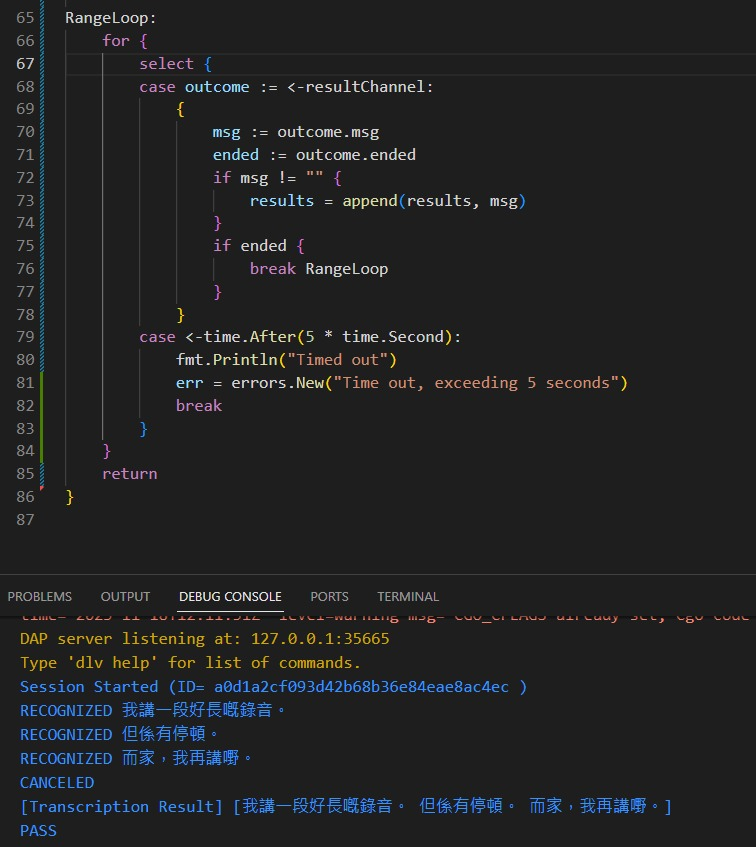

# 2023-12-05-Golang-Speech-to-Text

- Study the channel mechanism by implementing speech to text using azure sdk in golang.

- A dockerfile has been developed to let us explore the azure-sdk in linux environment (golang only support linux).

